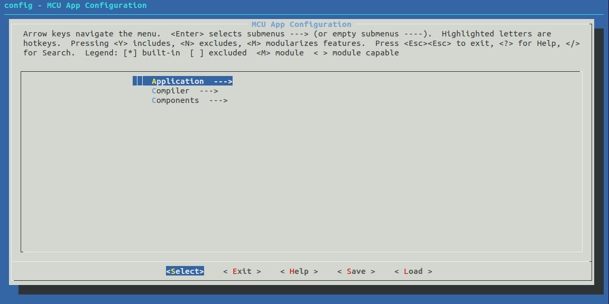

# Kconfig for ARM based MCUs

This example provides the ability to configure components and application
using kconfig language

Originally created for STM32 microcontrollers but it can be used for any ARM
based MCUs

Development environment consists of:
 * Ubuntu OS
 * STM32CubeIDE
 * STM32CubeMX
 * STM32CubeProg

## Get GNU Arm Embedded Toolchain

```bash
  sudo apt install gcc-arm-none-eabi

  arm-none-eabi-gcc --version
```

Alternative way is to download GNU Arm Embedded Toolchain from the
website https://developer.arm.com/open-source/gnu-toolchain/gnu-rm/downloads
and setup path to compiler binaries by adding the following line
into ~/.profile with your path to toolchain folder:

```bash
  export PATH="$PATH:$HOME/path/to/gcc-arm-none-eabi-8-2019-q3-update/bin"
```

Log out and log back in to update PATH variable

## Get project and build

```bash
  git clone https://github.com/mcu/kconfig.git

  cd kconfig
  make menuconfig
  make
```

## How it works

At first, "make" utility use "ls" command recursively to create a list of all
folders in the "components", "application". Then "make" creates a list of all
*.s, *.c, *.ld and *.a files in the project (ASSOURCES, CSOURCES, LINKERS, LIBS).
After that "make" starts the process of compiling, linking and generating the
binary file. It's easy but more correctly is to build components separately into
libraries

You can add *.h, *.c files and folders as you want into "components",
"application" folders. All source files will be compiled

## Comment

The implementation of makefile has its pros and cons. Since all header files
are visible to each source file during the build process it is not recommended
to use this example for large projects